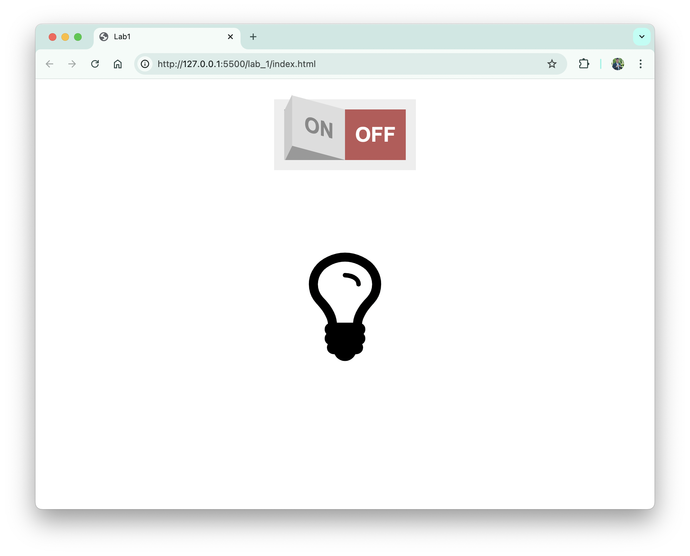
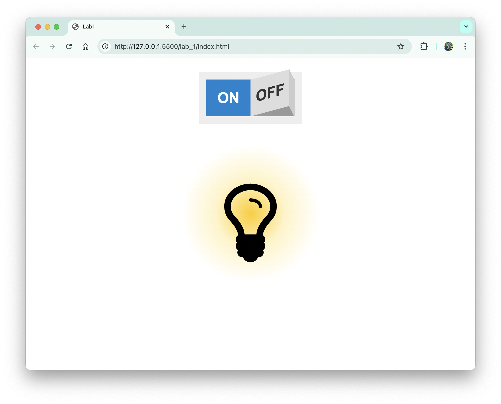
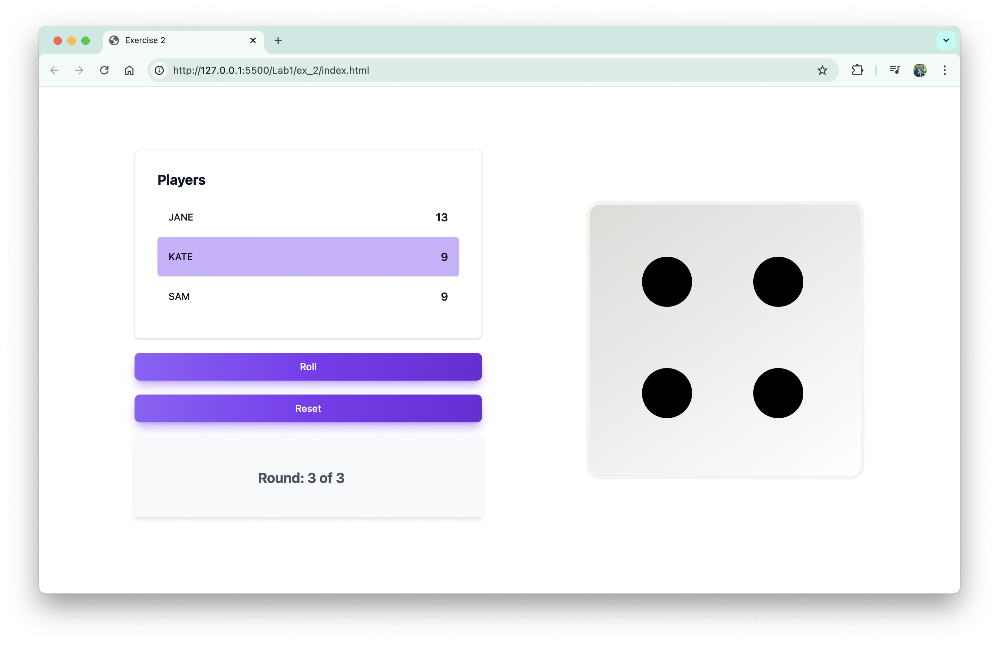

# Exercise 1

This lab exercise is focused on building a simple interactive web page using HTML, CSS, and JavaScript. The task involves creating a light switch interface that can toggle a lightbulb on and off.




## Project Structure

- **HTML**: The interface consists of a switch component and a lightbulb icon. The switch toggles between "On" and "Off" states.
- **CSS**: The styles control the appearance of the switch and the lightbulb. The lightbulb changes color when switched on or off.
- **JavaScript**: Handles the logic for toggling the lightbulb on and off when the switch is clicked.

### Files:

- `index.html`: The main HTML file containing the structure of the page.
- `style/style.css`: Contains the styles for the switch and lightbulb.
- `script/script.js`: Contains the JavaScript logic to toggle the lightbulb.

### How It Works:

1. The light switch is represented as a checkbox input wrapped in a label with two spans for the "On" and "Off" states.
2. When the checkbox is toggled, the lightbulb's class is updated, which in turn triggers a CSS style change, simulating the light turning on or off.

### How to Run:

Simply open the `index.html` file in your browser to see the interactive switch in action.

Enjoy experimenting with this simple web application!

# Exercise 2 - Dice Game 🎲

This is a simple web-based dice game where multiple players compete to score the highest points after a set number of rounds. The game features an interactive dice roll animation, player management, and dynamic score tracking.

## 🖼️ Screenshot



## 🎥 Video Demonstration

Check out a video demonstration of the game in action:

[](../Lab1/docs/lab1-ex2-video.mp4)

## 🚀 How to Play

1. **Set Up Players**: The game starts by asking the user for the number of players and their names.
2. **Rolling the Dice**: Each player takes turns rolling the dice by clicking the "Roll" button.
3. **Scoring**: The player’s score increases by the number shown on the dice.
4. **Winning**: After the predefined number of rounds, the player with the highest score wins.

## ✨ Features

- Smooth dice roll animation
- Player management (adding names, tracking scores)
- Rounds and turn management
- Automatic winner announcement and game reset

## 📜 Code Highlights

- JavaScript handles game logic, including player turns, round progression, and score calculation.
- Dice roll animation is powered by CSS transitions and keyframe animations.

## 🛠️ Tech Stack

- HTML
- CSS (including Tailwind for styling)
- JavaScript

## 📦 How to Run

1. Clone the repository:

    ```bash
    git clone https://github.com/your-username/dice-game.git
    ```

2. Navigate to the project directory:

    ```bash
    cd dice-game
    ```

3. Open `index.html` in your browser.

## 📸 Media

Enjoy the game and happy rolling! 🎉
