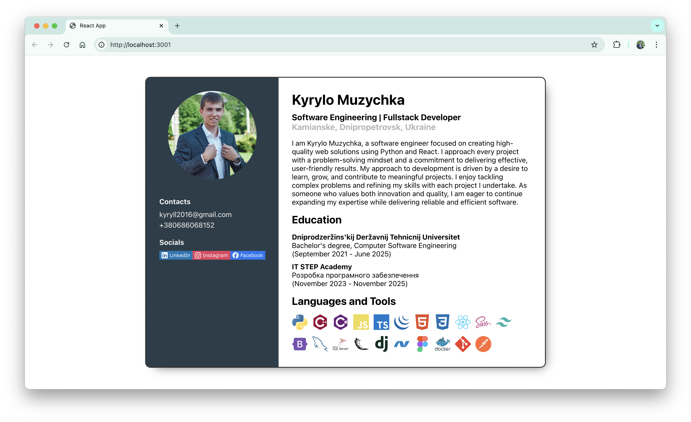

# CV

This exercise involves building a personal resume (CV) using React. The app must contain at least three components: contacts, education and stack. The application will consist of a single page that displays all the components in a complete resume format.

