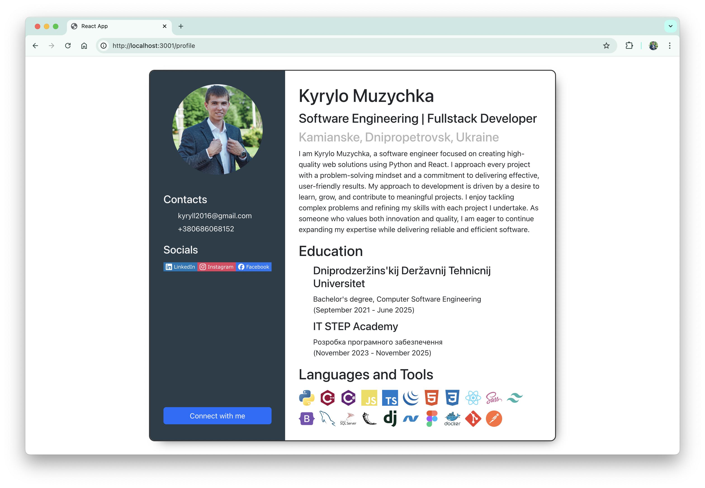
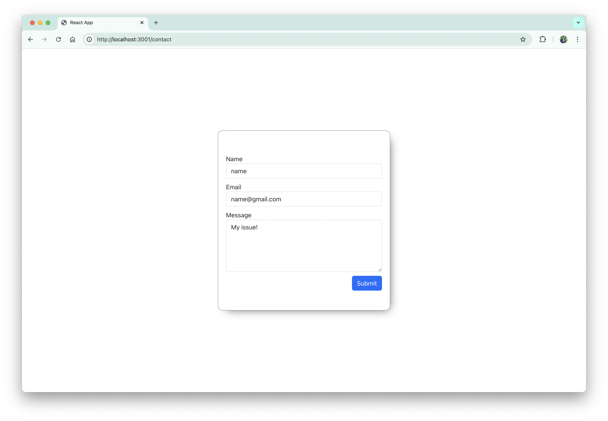
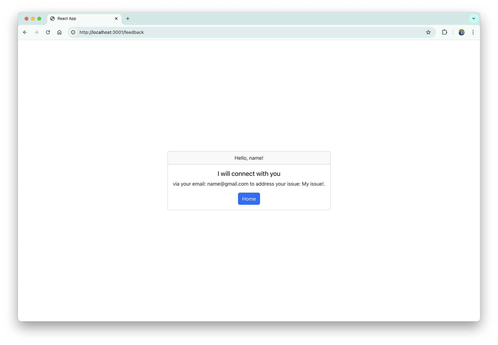

# Browse Router

Implementing a Contact Form with Submission and Thank You Page
In this lab, you will create a React application that includes the following:
- **Contact Page with a form that allows users to input:**
- **Form Submission:**

**Contact Page with a form that allows users to input:**
- Name
- Email
- Message (Text area)

**Form Submission:**
- After submitting the form, the user will be redirected to a Thank You page where the details from the form are displayed.
- A button should be present to allow the user to navigate back to the Home page.

